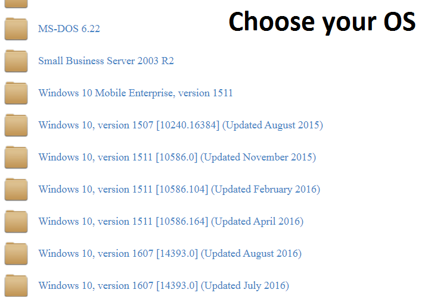

# RGDownloadTool
Clean alternative to "RG-Adguard Files Project" scripts. Lightweight, open-source, and works perfectly on 32-bit (x86) systems.

# Screenshots:

# How To Get UUID:

# Disclaimer:
- **Use at your own risk:** I am not responsible for any data loss or system damage.
- **No Affiliation:** This project is NOT affiliated with Microsoft or RG-Adguard.
- **Educational only:** This tool is for backup and educational purposes.
- **No Piracy:** This script does NOT include cracks, activators, or licenses.
# Credits:
RG-Adguard — For providing the original Windows file lists and server infrastructure.

Tatsuhiro Tsujikawa — For the amazing aria2c download engine.

Open Source Community — For keeping x86 software alive!
